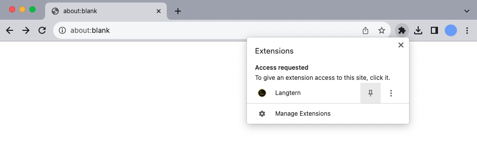
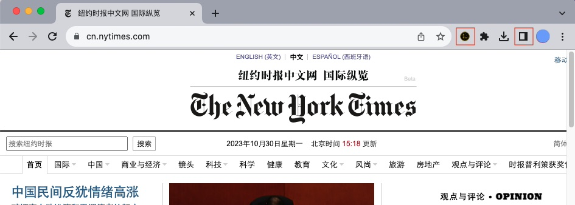
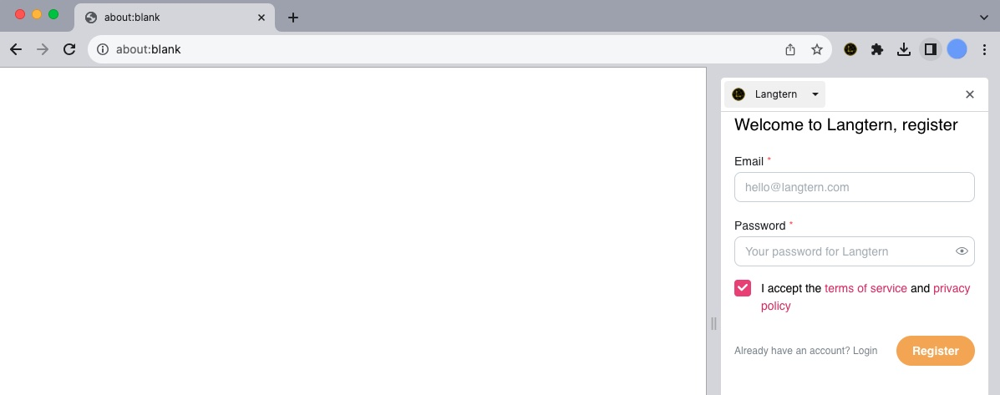
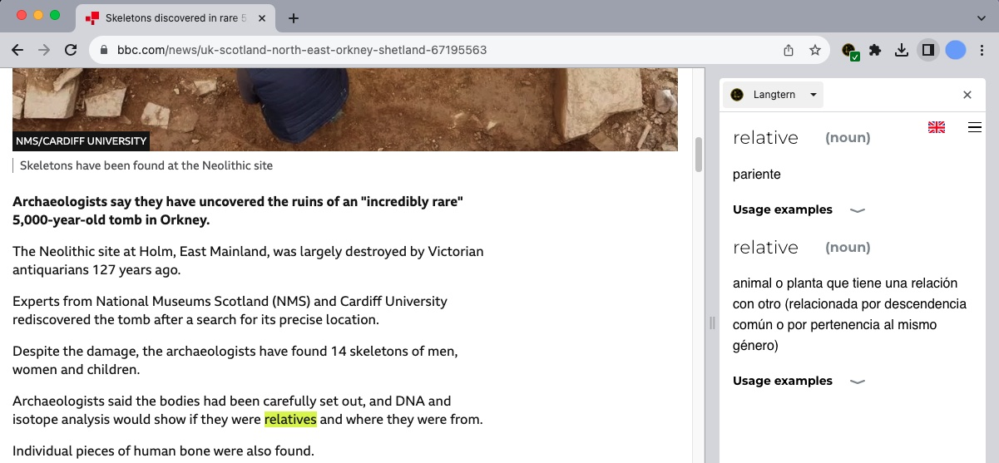

# How to install the Langtern Chrome extension

1. Go to the Chrome extension webstore 
<a href="https://chrome.google.com/webstore/detail/langtern/noofghepdoofpogfmbajnllfcdimfeip" target="_blank">clicling here</a>.

2. Sign-in to your Google account.

3. Click on the button "Add to Chrome" on the upper-right part of the page.

   

4. Accept the permissions needed by the Langtern extension.

5. Optionally, make the extension button prominent by pinning it: press on the puzzle piece button
next to the address bar and then on the pin button next to the Langtern extension.
This will make it appear on the first places among the extension icons.

   

6. When you are on a website where you need the Langtern popup dictionary, either
press the Langtern extension's icon in the extensions bar (to the right of the browser's
address bar) or press on the side panel button and then select 'Langtern' in the side panel
itself.

   

The first time, you will need to log in to your Langtern account. Create one if
you don't have it yet.

   

Don't forget to set the language you are studying with the little flag button on the side panel.

7. Use the extension, either for text in web pages, by placing the mouse over a word you
don't know:

   

Or watching a Youtube video with captions:

   

If you find any problems, just reload the page. If you have further doubts, you can write to
us at contact@langtern.com .

