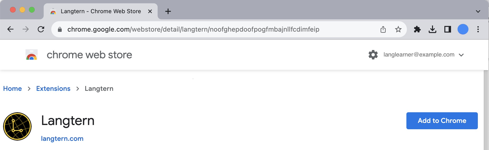
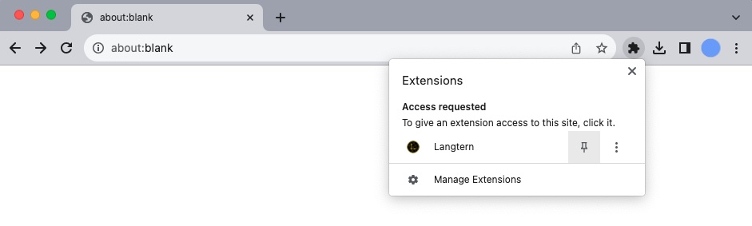
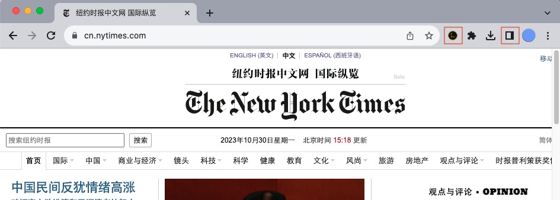
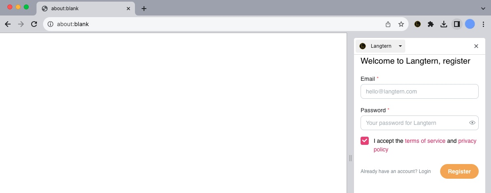
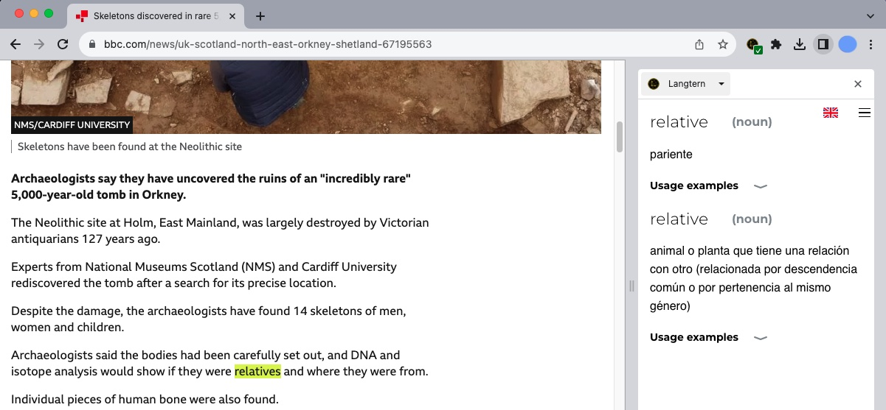

# Cómo instalar la extensión de Chrome de Langtern

1. Ir al listado de extensiones de Chrome
[pulsando aquí](https://chrome.google.com/webstore/detail/langtern/noofghepdoofpogfmbajnllfcdimfeip").

2. Inicia sesión con tu cuenta de Google.

3. Pulsa en el botón "Añadir a Chrome" en la parte de arriba a la derecha.

   

4. Acepta los permisos que Langtern necesita.

5. Opcionalmente, haz el botón de la extensión más visible, fijándolo: pulsa en el botón de la pieza de puzle
al lado de la barra de dirección y luego pulsa en el botón de fijar al lado de la extensión de Langtern.
Esto hará que aparezca en las primeras posiciones en la lista de extensiones.

   

6. Cuando estés en una web donde necesites el diccionario de Langtern, pulsa o bien
en el icono de la extensión de Langtern (a la derecha de la barra de dirección) o bien
en el botón del panel lateral, seleccionando posteriormente Langtern en el desplegable.

   

La primera vez, tendrás que iniciar sesión con tu cuenta de Langtern. Hazte una si todavía no tienes.

   

No olvides seleccionar el idioma que estudies con el botón de la banderita en el panel lateral.

7. USa la extensión, bien para texto en páginas web poniendo el ratón sobre una palabra que no conozcas:

   

O viendo un vídeo de Youtube con subtítulos:

   

Si tienes problemas, recarga la página. Si tienes más dudas, puedes escribirnos a contact@langtern.com .

